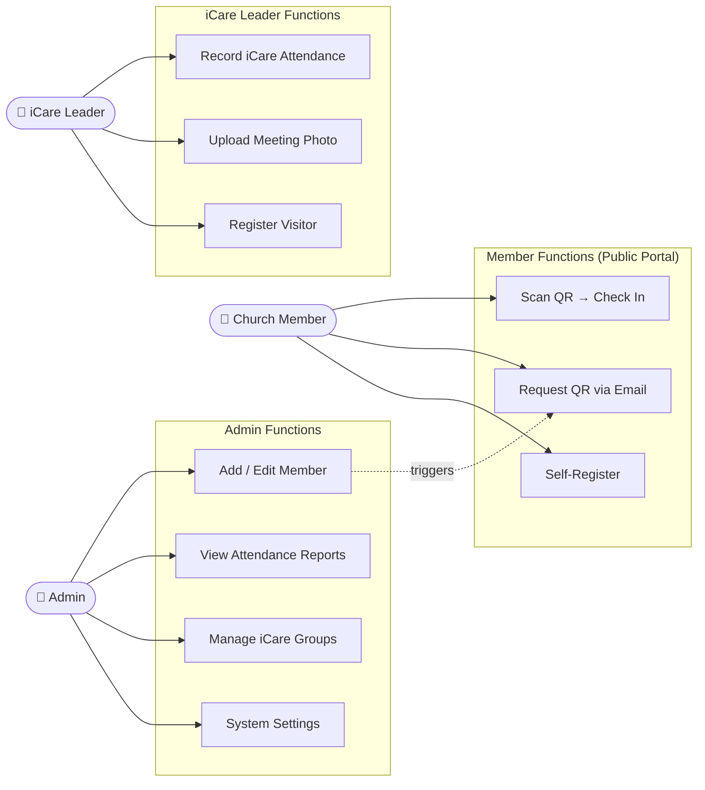
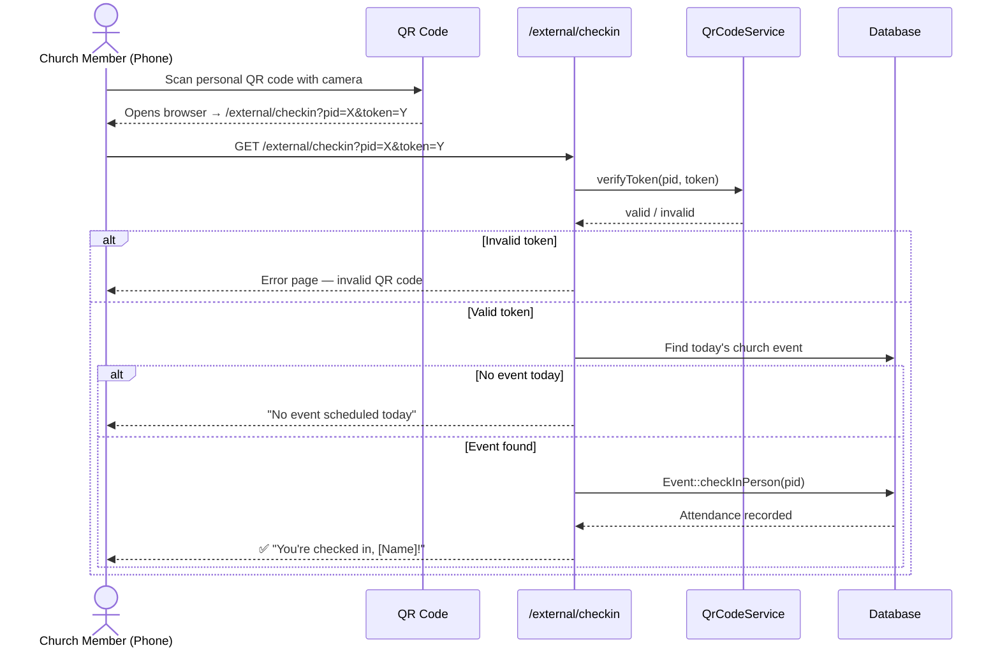
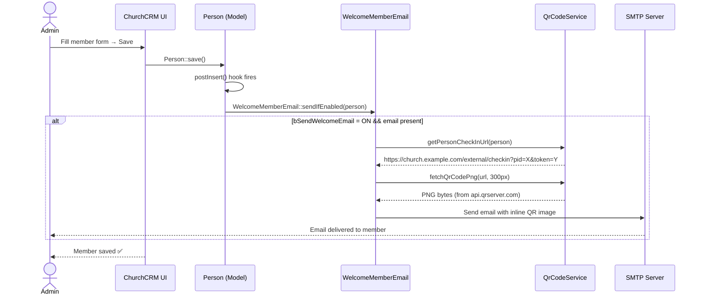
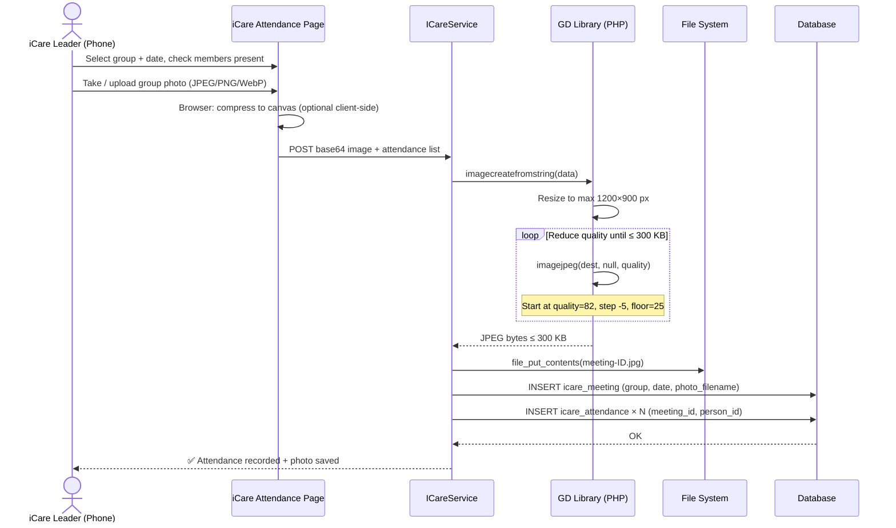
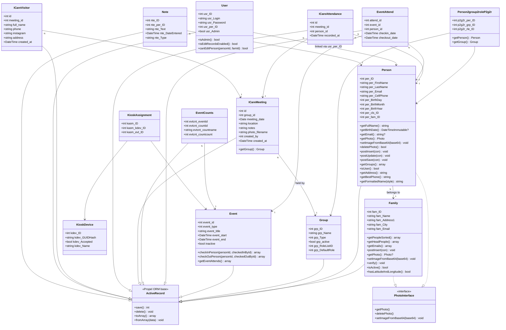
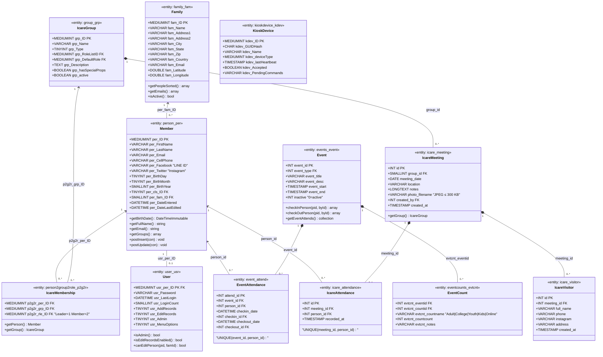

<h1 align="center">IFGF Taiwan — ChurchCRM</h1>

<p align="center">
  Church Management System for <strong>IFGF Taipei & Zhongli</strong><br>
  Member registry · iCare attendance · QR check-in · Birthday calendar · Member portal
</p>

<p align="center">
  <a href="LICENSE"></a>
  <a href="https://github.com/ifgf-tpe/CRM/releases"></a>
  
  
  
</p>

---

## Table of Contents

<!-- toc -->

- [Introduction](#introduction)
- [Execution Status](#execution-status)
- [Minimum Requirements](#minimum-requirements)
- [System Architecture](#system-architecture)
  - [Component Overview](#component-overview)
  - [Software Stack](#software-stack)
- [Use Case Diagram](#use-case-diagram)
- [Workflows (Sequence Diagrams)](#workflows-sequence-diagrams)
  - [UC1: QR Code Attendance Check-In](#uc1-qr-code-attendance-check-in)
  - [UC2: New Member Registration](#uc2-new-member-registration)
  - [UC3: iCare Attendance with Photo](#uc3-icare-attendance-with-photo)
- [Class Diagram](#class-diagram)
  - [Current State — Domain Entities](#current-state--domain-entities)
  - [Current State — Service, Email & Infrastructure](#current-state--service-email--infrastructure)
  - [Target Architecture — Planned Extensions](#target-architecture--planned-extensions)
- [Entity Relationship Diagram](#entity-relationship-diagram)
  - [Entity Overview](#entity-overview)
  - [Member (person\_per)](#member-person_per)
  - [iCare Group (group\_grp)](#icare-group-group_grp)
  - [iCare Meeting (icare\_meeting)](#icare-meeting-icare_meeting)
  - [iCare Member Attendance (icare\_attendance)](#icare-member-attendance-icare_attendance)
  - [iCare Visitor (icare\_visitor)](#icare-visitor-icare_visitor)
  - [Event (events\_event)](#event-events_event)
  - [Event Attendance (event\_attend)](#event-attendance-event_attend)
  - [Event Count (eventcounts\_evtcnt)](#event-count-eventcounts_evtcnt)
  - [Business Rules](#business-rules)
- [API Reference](#api-reference)
- [Installation](#installation)
- [Usage Guides](#usage-guides)
- [Contributing](#contributing)
- [References](#references)

<!-- tocstop -->

---

## Introduction

ChurchCRM is an open-source church management platform, adapted here for **IFGF Taipei & Zhongli** — an Indonesian Fellowship of God's Family congregation in Taiwan.

1. **Background**
   - Members are currently tracked across three separate systems: a Google Apps Script spreadsheet project (`church-member-management`), a FastAPI web service (`IFGF-Web-Server`), and a React admin frontend (`IFGF-Web-Admin`).
   - Data is fragmented; birthday reminders, QR attendance, iCare tracking, and member communication each live in different tools.

2. **Importance**
   - Consolidating into ChurchCRM gives the church a single source of truth: full member profiles, weekly Sunday attendance via personal QR codes, iCare cell-group attendance with photo evidence, birthday calendar, and a public member portal — all in one deployed PHP application.

3. **Contribution**
   - IFGF-specific extensions built on top of ChurchCRM 7.x:
     - **Static QR code per member** (HMAC-signed, linked to person ID only) for frictionless Sunday attendance scanning.
     - **iCare attendance module** (`icare_meeting`, `icare_attendance`, `icare_visitor` tables) with compressed photo upload (≤ 300 KB enforced server-side).
     - **Welcome email** with inline QR code sent automatically on member creation.
     - **Public member portal** (`/external/member-portal`) for QR code resend and self-registration.

4. **Challenges**
   - **Schema extension without breaking upstream**: New iCare tables use isolated FK constraints; no upstream ChurchCRM tables were modified.
   - **Mobile photo upload**: Photos from Android/iPhone are compressed server-side (GD library, quality reduction loop) to always produce ≤ 300 KB output regardless of the original camera resolution.
   - **Birthday calendar**: ChurchCRM's built-in `BirthdaysCalendar` surfaces birthdays inside the app; Google Calendar push requires a service-account OAuth integration (planned).

---

## Execution Status

| Feature | Status | Date | Notes |
| --- | --- | --- | --- |
| Base ChurchCRM 7.x install | ✅ | 2026-05-04 | Upstream release `b56406a` |
| Member QR code (static, HMAC-signed) | ✅ | 2026-05-13 | `QrCodeService`, `/external/checkin` |
| Welcome email with inline QR | ✅ | 2026-05-13 | `WelcomeMemberEmail`, `bSendWelcomeEmail` setting |
| Member self-service portal | ✅ | 2026-05-13 | `/external/member-portal`, QR resend by email |
| iCare meeting + attendance tables | ✅ | 2026-05-13 | `7.4.0-icare.sql` migration |
| iCare attendance + photo upload (≤ 300 KB) | ✅ | 2026-05-13 | `ICareService::saveMeetingPhoto()` |
| iCare visitor registration | ✅ | 2026-05-13 | `icare_visitor` table |
| iCare attendance UI (leader view) | ⏳ | — | Routes scaffolded; views in progress |
| Birthday → Google Calendar push | ⏳ | — | Needs Google Calendar API + service account |
| Google OAuth login for members | ⏳ | — | Requires `league/oauth2-google` + `per_google_sub` column |
| Member self-service profile edit | ⏳ | — | Blocked by Google OAuth |
| iCare co-leader role | ⏳ | — | Schema and UI not yet built |
| CGSL group tracking | ⏳ | — | Planned; no timeline |
| Fingerprint device TSV import | ⏳ | — | Planned; no timeline |

---

## Minimum Requirements

| Component | Requirement |
| --- | --- |
| CPU | 2-core 2 GHz (ARM or x86) |
| RAM | 1 GB minimum, 2 GB recommended |
| Storage | 10 GB for application + media |
| PHP | 8.4+ with GD, mbstring, pdo_mysql, json, intl |
| MySQL / MariaDB | MySQL 8.0+ or MariaDB 10.11+ |
| Web server | Apache 2.4+ (mod_rewrite) or nginx 1.24+ |
| Node.js | 24 LTS (build only — not needed at runtime) |
| Composer | 2.x |
| Docker | 24+ (optional — recommended for local dev via DDEV) |

**Recommended local development:** [DDEV](https://ddev.readthedocs.io/) — installs PHP, MariaDB, Apache, and Node automatically via Docker.

---

## System Architecture

### Component Overview

```mermaid
graph TD
    Browser["Admin Browser\n(Tabler / Bootstrap 5 UI)"]
    Phone["Church Member\n(Android / iPhone)"]
    Portal["Public Member Portal\n/external/member-portal"]
    Checkin["QR Check-in\n/external/checkin"]
    CRM["ChurchCRM PHP App\n(Slim 4 MVC)"]
    DB[(MySQL 8\nchurchcrm DB)]
    SMTP["SMTP Server\n(outgoing email)"]
    GCalendar["Google Calendar API\n(planned)"]
    QRApi["api.qrserver.com\n(QR PNG generation)"]

    Browser -->|HTTPS| CRM
    Phone -->|Scan QR → HTTPS| Checkin
    Phone -->|Upload photo| CRM
    Portal -->|email lookup + resend| CRM
    Checkin --> CRM
    CRM --> DB
    CRM -->|Welcome email + QR| SMTP
    CRM -->|Fetch QR PNG| QRApi
    CRM -.->|Birthday events (planned)| GCalendar
```

### Software Stack

| Layer | Technology | Version |
| --- | --- | --- |
| Language | PHP | 8.4 |
| HTTP framework | Slim 4 | 4.x |
| ORM | Propel 2 | 2.x |
| Templating | Twig (email) / PHP views | 3.x |
| Email | PHPMailer | 6.x |
| Frontend CSS | Tabler + Bootstrap 5 | 1.x / 5.x |
| JS bundler | Webpack 5 + TypeScript | 5.x |
| Linter | Biome | 2.x |
| Database | MySQL / MariaDB | 8.0 / 10.11 |
| Dev environment | DDEV | 1.24+ |
| CI testing | Cypress | 15.x |

---

## Use Case Diagram



---

## Workflows (Sequence Diagrams)

### UC1: QR Code Attendance Check-In



### UC2: New Member Registration



### UC3: iCare Attendance with Photo



---

## Class Diagram

Two diagrams are presented: **Current State** (what is implemented) and **Target Architecture** (what must be added to satisfy all requirements discussed in this project).

---

### Current State — Domain Entities

> Scanned from `src/ChurchCRM/model/ChurchCRM/`. All non-Base, non-Query classes. Propel `ActiveRecord` represents the generated ORM base.



---

### Current State — Service, Email & Infrastructure

```mermaid
classDiagram
    direction TB

    %% ── Infrastructure ───────────────────────────────────────────────────────

    class IAuthenticationProvider {
        <<interface>>
        +authenticate(request) AuthenticationResult
        +validateUserSessionIsActive(update) AuthenticationResult
        +getCurrentUser() User?
        +endSession() void
        +getPasswordChangeURL() string
    }

    class LocalAuthentication {
        +authenticate(request) AuthenticationResult
        +validateUserSessionIsActive(update) AuthenticationResult
        +getCurrentUser() User?
        +endSession() void
        +getPasswordChangeURL() string
        +getTwoFactorQRCode(username, secret)$ QrCode
    }

    class AuthenticationManager {
        <<static facade>>
        +getAuthenticationProvider()$ IAuthenticationProvider
        +getCurrentUser()$ User
        +isUserAuthenticated()$ bool
        +authenticate(request)$ AuthenticationResult
        +endSession(preventRedirect)$ void
        +ensureAuthentication()$ void
        +redirectHomeIfFalse(hasAccess, role)$ void
        +redirectHomeIfNotAdmin()$ void
    }

    class AuthenticationResult {
        +bool isAuthenticated
        +string message
    }

    class HookManager {
        <<static>>
        +addAction(hook, callback, priority)$ void
        +doAction(hook, args)$ void
        +addFilter(hook, callback, priority)$ void
        +applyFilters(hook, value, args)$ mixed
        +removeAction(hook, callback)$ bool
        +hasAction(hook)$ bool
        +doingHook(hook)$ bool
        +reset()$ void
    }

    class SystemConfig {
        <<static DTO>>
        +getValue(name)$ mixed
        +getBooleanValue(name)$ bool
        +getIntValue(name)$ int
        +setValue(name, value)$ void
        +isEmailEnabled()$ bool
        +hasValidMailServerSettings()$ bool
        +init(configs)$ void
    }

    class SystemURLs {
        <<static DTO>>
        +getRootPath()$ string
        +getDocumentRoot()$ string
        +getImagesRoot()$ string
        +getURL(index)$ string
        +getCSPNonce()$ string?
    }

    LocalAuthentication ..|> IAuthenticationProvider
    AuthenticationManager --> IAuthenticationProvider : delegates to
    AuthenticationManager --> AuthenticationResult : returns

    %% ── Services ─────────────────────────────────────────────────────────────

    class QrCodeService {
        <<static utility>>
        -QR_API$ = https://api.qrserver.com
        +getPersonCheckInUrl(person)$ string
        +fetchQrCodePng(url, sizePx)$ string
        +generateToken(personId)$ string
        +verifyToken(personId, token)$ bool
        -getSecret()$ string
    }

    class ICareService {
        -PHOTO_MAX_WIDTH$ = 1200
        -PHOTO_MAX_HEIGHT$ = 900
        -PHOTO_QUALITY$ = 82
        -PHOTO_MAX_BYTES$ = 307200
        -PHOTO_DIR$ = iCare
        +getGroupsForUser(userId) array
        +getGroupMembers(groupId) array
        +getMeetingsForGroup(groupId, limit) array
        +getMeetingDetail(meetingId) array
        +createMeeting(groupId, userId, data) ICareMeeting
        +saveMeetingPhoto(meetingId, base64DataUri) string
        +getMeetingPhotoPath(meetingId) string?
        +deleteMeeting(meetingId) void
    }

    class PersonService {
        +search(term, includeFamilyRole) array
        +getPeopleEmailsAndGroups() array
        +addVolunteerOpportunity(personId, oppId) bool
        +removeVolunteerOpportunity(personId, oppId) void
        +getFamilyList(roleHead, roleSpouse, cls, term) array
        +getMissingGenderDataCount() int
    }

    class GroupService {
        +addUserToGroup(groupId, personId, roleId) array
        +removeUserFromGroup(groupId, personId) void
        +getGroupRoles(groupId) array
        +getGroupMembers(groupId, personId) array
        +addGroupRole(groupId, roleName) array
        +deleteGroupRole(groupId, roleId) array
    }

    class EventService {
        -MAX_REPEAT_OCCURRENCES$ = 366
        +createRepeatEvents(data) int[]
    }

    class DashboardService {
        +getFamilyCount() array
        +getDashboardStats() array
        +getGroupStats() array
        +getLatestMembers(limit) array
        +getUpdatedMembers(limit) array
    }

    class UserService {
        +getAllUsers() collection
        +getUserById(id) User?
        +getUserStats() array
        +isUserLocked(user) bool
        +getLockedUsers() collection
    }

    ICareService ..> ICareMeeting : manages
    ICareService ..> ICareAttendance : records
    ICareService ..> ICareVisitor : registers
    ICareService ..> SystemURLs : uses
    QrCodeService ..> Person : generates URL for
    QrCodeService ..> SystemConfig : reads secret
    QrCodeService ..> SystemURLs : builds URL
    PersonService ..> Person : queries
    GroupService ..> Group : manages
    GroupService ..> Person2group2roleP2g2r : manages
    EventService ..> Event : creates

    %% ── Email hierarchy ──────────────────────────────────────────────────────

    class BaseEmail {
        <<abstract>>
        #PHPMailer mail
        #Twig\Environment twig
        +send() bool
        +getError() string
        +addStringAttachment(data, filename) void
        +buildMessage() string
        +getCommonTokens() array
        #getTemplateName() string
        #getTokens() array*
        #getPreheader() string
    }

    class BaseUserEmail {
        <<abstract>>
        #User user
        +getTokens() array
    }

    class WelcomeMemberEmail {
        -Person person
        -string checkInUrl
        -string? qrCid
        +getTokens() array
        +getSubSubject() string
        +getPreheader() string
        +sendIfEnabled(person)$ void
    }

    class NewPersonOrFamilyEmail {
        +getTokens() array
        +sendIfConfigured(obj)$ void
    }

    class NewAccountEmail {
        -string password
        +getTokens() array
    }

    class ResetPasswordEmail {
        -string password
        +getTokens() array
    }

    class TestEmail {
        +getTokens() array
    }

    class FamilyVerificationEmail {
        +getTokens() array
    }

    BaseEmail <|-- BaseUserEmail
    BaseEmail <|-- WelcomeMemberEmail
    BaseEmail <|-- NewPersonOrFamilyEmail
    BaseEmail <|-- TestEmail
    BaseEmail <|-- FamilyVerificationEmail
    BaseUserEmail <|-- NewAccountEmail
    BaseUserEmail <|-- ResetPasswordEmail
    BaseUserEmail <|-- AccountDeletedEmail
    BaseUserEmail <|-- LockedEmail
    BaseUserEmail <|-- UnlockedEmail
    BaseUserEmail <|-- ResetPasswordTokenEmail

    WelcomeMemberEmail ..> QrCodeService : fetches QR PNG
    WelcomeMemberEmail ..> Person : sends to
    NewPersonOrFamilyEmail ..> Person : notifies about
    NewPersonOrFamilyEmail ..> SystemConfig : checks recipients
```



---

### Target Architecture — Planned Extensions

```mermaid
classDiagram
    direction TB

    %% ── Existing classes referenced ──────────────────────────────────────────

    class Person { }
    class Group { }
    class IAuthenticationProvider {
        <<interface>>
    }
    class QrCodeService { }
    class WelcomeMemberEmail { }

    %% ── Google OAuth — member & admin login ──────────────────────────────────

    class GoogleOAuthProvider {
        <<planned>>
        -string clientId
        -string clientSecret
        +authenticate(request) AuthenticationResult
        +validateUserSessionIsActive(update) AuthenticationResult
        +getCurrentUser() Person?
        +endSession() void
        +getPasswordChangeURL() string
        +generateRedirectUrl(state) string
        +exchangeCode(code) GoogleProfile
        +findOrLinkPerson(googleSub, email) Person?
        +linkPersonToGoogleSub(person, sub) void
    }

    class GoogleOAuthRequest {
        <<planned>>
        +string code
        +string state
        +string redirectUri
    }

    class GoogleProfile {
        <<planned>>
        +string sub
        +string email
        +string name
        +string picture
    }

    note for Person "Requires new column:\nper_google_sub VARCHAR(64) UNIQUE NULL\nper_google_email VARCHAR(100) NULL"

    %% ── iCare Co-leaders ─────────────────────────────────────────────────────

    class ICareCoLeader {
        <<planned>>
        +int id
        +int group_id
        +int person_id
        +Date added_date
        +bool is_active
        +getGroup() Group
        +getPerson() Person
    }

    note for ICareCoLeader "Table: icare_co_leaders\nRole: can submit attendance\nfor their assigned group"

    %% ── Google Calendar birthday push ────────────────────────────────────────

    class GoogleCalendarService {
        <<planned>>
        -string calendarId
        -GoogleClient client
        +createBirthdayEvent(person) string
        +updateBirthdayEvent(person) void
        +deleteBirthdayEvent(person) void
        +syncAllBirthdays() array
        +getBirthdayEventId(person) string?
        -buildEventDescription(person) string
    }

    note for GoogleCalendarService "Requires:\n- Google service account JSON\n- sGoogleCalendarId setting\n- per_birthday_event_id column on Person\n(or separate mapping table)"

    %% ── Member self-service (post-OAuth) ─────────────────────────────────────

    class MemberPortalService {
        <<planned>>
        +findPersonByEmail(email) Person?
        +sendQrCodeByEmail(person) void
        +updateMemberProfile(person, data) void
        +createMemberSession(person) string
        +validateMemberSession(token) Person?
    }

    class MemberSession {
        <<planned>>
        +string token
        +int person_id
        +DateTime expires_at
        +bool isExpired() bool
    }

    %% ── Fingerprint import ───────────────────────────────────────────────────

    class FingerprintImportService {
        <<planned>>
        +importTsv(filePath, activityTypeId) array
        +parseRow(line) array
        +matchPersonByFingerprintId(fpId) Person?
    }

    %% ── Birthday .ics export ─────────────────────────────────────────────────

    class BirthdayIcsExportService {
        <<planned>>
        +generateIcsFeed() string
        +generateIcsForPerson(person) string
        -formatDate(birthDay, birthMonth) string
    }

    %% ── Relationships ────────────────────────────────────────────────────────

    GoogleOAuthProvider ..|> IAuthenticationProvider
    GoogleOAuthProvider ..> GoogleOAuthRequest : accepts
    GoogleOAuthProvider ..> GoogleProfile : produces
    GoogleOAuthProvider ..> MemberPortalService : delegates lookup
    GoogleOAuthProvider ..> Person : links

    ICareCoLeader --> Group
    ICareCoLeader --> Person

    GoogleCalendarService ..> Person : reads birthday
    GoogleCalendarService ..> SystemConfig : reads calendarId

    MemberPortalService ..> Person : looks up & updates
    MemberPortalService ..> QrCodeService : generates QR URL
    MemberPortalService ..> WelcomeMemberEmail : sends QR email
    MemberPortalService ..> MemberSession : creates

    FingerprintImportService ..> Person : matches by fp_id
    BirthdayIcsExportService ..> Person : reads birthdays
```

> Classes and associations that **must be added** to satisfy the requirements discussed in this project. Marked `<<planned>>`.



---

## Entity Relationship Diagram

> **Note:** The ERD is expressed as a **UML Class Diagram** because each database table maps 1-to-1 to a Propel ORM model class. The `<<entity>>` stereotype marks persistence classes; attributes carry SQL types; key ORM methods are included. This format is richer than a plain ERD while remaining a complete database specification.

### Key Distinction: Person vs User

| Concept | Meaning |
| --- | --- |
| **Person** (`person_per`) | Every human stored in the system — church members, family members, guests, CRM staff. No login required. |
| **User** (`user_usr`) | The subset of Persons who have CRM login credentials. `User` is a **specialization of Person**: its primary key `usr_per_ID` is the same value as `person_per.per_ID`. You cannot create a User without first creating a Person. Most Persons never become Users. |

> **Rule:** Person ← is-a ← User. A User record adds credentials and permissions on top of an existing Person record. They share one PK value.

### Entity Overview

| ORM Class | DB Table | Purpose |
| --- | --- | --- |
| `Person` | `person_per` | Every person in the system (members, family, staff) |
| `User` | `user_usr` | **Specializes Person** — adds CRM login + permissions |
| `Family` | `family_fam` | Household / church-location grouping |
| `Group` | `group_grp` | Generic group (iCare cells, Sunday School, any type) |
| `GroupMembership` | `person2group2role_p2g2r` | Person ↔ Group ↔ Role junction table |
| `IcareMeeting` | `icare_meeting` | One weekly iCare cell-group session |
| `IcareAttendance` | `icare_attendance` | Member attendance at an iCare session |
| `IcareVisitor` | `icare_visitor` | Walk-in non-member at iCare |
| `Event` | `events_event` | All church events (Sunday, Worship Night, special) |
| `EventAttendance` | `event_attend` | Individual QR scan check-in at an event |
| `EventHeadcount` | `eventcounts_evtcnt` | Aggregate per-category count per event session |
| `KioskDevice` | `kioskdevice_kdev` | Registered check-in tablet/kiosk |



### Member (`person_per`)

Represents every registered church member (jemaat). Sourced from the **Daftar Jemaat** registration form.

| Column | Type | Notes |
| --- | --- | --- |
| `per_ID` | INT PK | Auto-increment |
| `per_FirstName` | VARCHAR(50) | Full name (Latin script) |
| `per_LastName` | VARCHAR(50) | — |
| `per_Email` | VARCHAR(50) | Primary contact / login |
| `per_CellPhone` | VARCHAR(30) | WhatsApp number |
| `per_Facebook` | VARCHAR(50) | LINE ID (re-used field) |
| `per_Twitter` | VARCHAR(50) | Instagram handle |
| `per_BirthDay/Month/Year` | TINYINT/SMALLINT | Date of birth |
| `per_Address1` | VARCHAR(50) | Taiwan domicile area |
| `per_Address2` | VARCHAR(50) | Indonesian domicile |
| `per_cls_ID` | TINYINT | **Kategori**: Adult / College / Teens & Youth / Kids |
| `per_fam_ID` | SMALLINT FK → `family_fam` | Church location family grouping |
| `per_DateEntered` | TIMESTAMP | Registration timestamp |
| *(custom)* | — | Chinese name (中文名) |
| *(custom)* | — | Profession (Siswa / Mahasiswa / Pekerja) |
| *(custom)* | — | Education level |
| *(custom)* | — | IFGF church location (Taipei / Zhongli) |
| *(custom)* | — | Baptized (Y/N) |
| *(custom)* | — | Indonesian home church |

**Member Categories (`per_cls_ID`):**

| Kategori | Condition |
| --- | --- |
| Kids | SD (elementary school) |
| Teens and Youth | Siswa/SMP or SMA/SMK |
| College | Siswa/Mahasiswa + S1 or Diploma |
| Adult | Pekerja (worker) |

### iCare Group (`group_grp`)

| Column | Type | Notes |
| --- | --- | --- |
| `grp_ID` | SMALLINT PK | Auto-increment |
| `grp_Name` | VARCHAR(50) | e.g., "iCare TMS", "iCare Keelung" |
| `grp_Type` | TINYINT | Group type ID for iCare |
| `grp_active` | BOOLEAN | Active / disbanded |
| `grp_RoleListID` | SMALLINT | Roles: Leader, Member |

**Known groups:** `iCare TMS` · `iCare U` · `iCare Keelung` · `iCare Linkou` · `iCare Immanuel` · `iCare Freshcare` · `iCare Tamkang` · `iCare Hsinchu` · `iCare Liming` · `iCare Home`

**Member → iCare via `person2group2role_p2g2r`:**

| Column | Type | Notes |
| --- | --- | --- |
| `p2g2r_per_ID` | FK → `person_per` | Member |
| `p2g2r_grp_ID` | FK → `group_grp` | iCare group |
| `p2g2r_rle_ID` | FK → `list_lst` | Role: Leader or Member |

### iCare Meeting (`icare_meeting`)

One row per weekly iCare session.

| Column | Type | Notes |
| --- | --- | --- |
| `id` | INT PK | Auto-increment |
| `group_id` | SMALLINT FK → `group_grp` | Which iCare group |
| `meeting_date` | DATE | Date of the session |
| `location` | VARCHAR(255) | Physical venue (optional) |
| `notes` | TEXT | Leader notes |
| `photo_filename` | VARCHAR(255) | Group photo — JPEG, ≤ 300 KB |
| `created_by` | INT FK → user | CRM user who recorded attendance |
| `created_at` | TIMESTAMP | |

### iCare Member Attendance (`icare_attendance`)

| Column | Type | Notes |
| --- | --- | --- |
| `id` | INT PK | Auto-increment |
| `meeting_id` | INT FK → `icare_meeting` | Which session |
| `person_id` | INT FK → `person_per` | Attending member |
| `recorded_at` | TIMESTAMP | |
| **UNIQUE** | (`meeting_id`, `person_id`) | No duplicate check-ins |

### iCare Visitor (`icare_visitor`)

Tracks **new walk-in visitors** (not yet members) who come to an iCare session.

| Column | Type | Notes |
| --- | --- | --- |
| `id` | INT PK | Auto-increment |
| `meeting_id` | INT FK → `icare_meeting` | Session visited |
| `full_name` | VARCHAR(100) | Full name |
| `phone` | VARCHAR(30) | WhatsApp / phone |
| `instagram` | VARCHAR(100) | Instagram or social media handle |
| `address` | VARCHAR(255) | Residential area (Taiwan) |
| `created_at` | TIMESTAMP | |

### Event (`events_event`)

| Event Type | Examples | Location |
| --- | --- | --- |
| **Super Sunday** | Weekly Sunday Gathering | Taipei (TPE) / Zhongli (ZL) |
| **iCare** | Weekly cell group meeting | Per-group venue |
| **Worship Night** | School-based, volunteer, open | Taipei / Zhongli |
| **Special Event** | Passover, Christmas, Retreat | Taipei / Zhongli / Offsite |

| Column | Type | Notes |
| --- | --- | --- |
| `event_id` | INT PK | Auto-increment |
| `event_type` | INT FK → `event_types` | Event category |
| `event_title` | VARCHAR(255) | e.g., "Super Sunday — Taipei" |
| `event_start` | TIMESTAMP | |
| `event_end` | TIMESTAMP | |
| `inactive` | INT | 0 = active |

### Event Attendance (`event_attend`)

Records individual member check-ins via personal QR code.

| Column | Type | Notes |
| --- | --- | --- |
| `attend_id` | INT PK | Auto-increment |
| `event_id` | INT FK → `events_event` | Which event |
| `person_id` | INT FK → `person_per` | Who checked in |
| `checkin_date` | TIMESTAMP | Scan time |
| `checkout_date` | TIMESTAMP | Optional checkout |
| **UNIQUE** | (`event_id`, `person_id`) | One check-in per person per event |

### Event Count (`eventcounts_evtcnt`)

Aggregate headcount per event, broken down by Kategori.

| Column | Type | Notes |
| --- | --- | --- |
| `evtcnt_eventid` | INT FK → `events_event` | Which event |
| `evtcnt_countname` | VARCHAR(20) | Adult / College / Teens & Youth / Kids / Online |
| `evtcnt_countcount` | INT | Number of attendees |
| `evtcnt_notes` | VARCHAR(20) | Reporter name |

### Business Rules

1. **Primary iCare**: Every member is assigned to exactly one primary iCare group via `person2group2role_p2g2r`. `"Belum mengikuti"` means not yet assigned.
2. **Cross-iCare visits**: A member may attend any iCare meeting — `icare_attendance` is not restricted to their primary group.
3. **New visitors at iCare**: Stored in `icare_visitor` (lightweight record). After follow-up, they can be promoted to a full member and assigned an iCare group.
4. **Sunday attendance**: Captured by QR code scan → `event_attend`. Aggregate counts (Adult/College/Youth/Kids/Online) also recorded in `eventcounts_evtcnt`.
5. **Location split**: Super Sunday runs in **Taipei (TPE)** and **Zhongli (ZL)** independently — each is a separate `events_event` row.
6. **QR code stability**: The QR code encodes `HMAC-SHA256(personId, secret)` and never changes when member details change. Only re-generated on explicit member request.
7. **Photo size**: iCare meeting photos are compressed server-side to ≤ 300 KB (JPEG, max 1200×900 px) regardless of the original uploaded resolution.

---

## API Reference

### Public Endpoints (no login required)

| Method | Path | Description |
| --- | --- | --- |
| GET | `/external/member-portal` | Member self-service portal page |
| POST | `/external/member-portal/resend-qr` | Email QR code to member by address |
| GET | `/external/checkin?pid=X&token=Y` | QR scan → record attendance + confirmation |

### Admin Endpoints (login required)

| Method | Path | Description |
| --- | --- | --- |
| GET | `/people/view/{id}` | Member profile (includes QR code card) |
| GET/POST | `/v2/icare/{groupId}/attendance` | Record iCare attendance + photo |
| GET | `/api/people` | Member list (JSON) |
| POST | `/api/public/register/family` | Public family registration (if enabled) |

### iCare API (JSON, login required)

| Method | Path | Description |
| --- | --- | --- |
| GET | `/api/icare/groups` | Groups the current user leads |
| GET | `/api/icare/groups/{id}/members` | Members of a group |
| GET | `/api/icare/groups/{id}/meetings` | Meeting history for a group |
| POST | `/api/icare/groups/{id}/meetings` | Create meeting + record attendance |
| POST | `/api/icare/meetings/{id}/photo` | Upload/replace meeting photo |
| GET | `/api/icare/meetings/{id}` | Meeting detail + attendance list |
| DELETE | `/api/icare/meetings/{id}` | Delete meeting and photo |

---

## Installation

### Recommended: DDEV (local development)

```bash
# 1. Clone the repo
git clone https://github.com/ifgf-tpe/CRM.git churchcrm
cd churchcrm

# 2. Install dependencies
npm install        # Node packages + locale files
cd src && composer install && cd ..

# 3. Build frontend assets
npm run build

# 4. Start DDEV (handles MariaDB + Apache + PHP automatically)
ddev start

# 5. Apply iCare schema (one-time)
ddev exec mysql churchcrm < src/mysql/upgrade/7.4.0-icare.sql

# 6. Open in browser
ddev launch
# Default credentials: admin / changeme
```

### Docker Compose (production-like)

```bash
cd docker
cp .env.example .env   # edit passwords
docker compose -f docker-compose.nginx.yaml up -d
```

### Configuration

After first login: **Admin → System Settings → New Members & Greeting**

| Setting | Purpose |
| --- | --- |
| `bSendWelcomeEmail` | Send welcome email + QR code on new member creation |
| `sWelcomeEmailSubject` | Email subject line (leave blank for default) |
| `sQrCodeSecret` | HMAC signing secret for QR tokens — set to a long random string |

---

## Usage Guides

Step-by-step usage guides are in [`future-work.md`](future-work.md) → **Feature Usage Guides**:

- **Guide 1**: [Weekly Attendance via QR Code](future-work.md#guide-1-weekly-attendance-via-qr-code)
- **Guide 2**: [Member Registration Flow](future-work.md#guide-2-member-registration-flow) (birthday, QR code, welcome email)
- **Guide 3**: [Member Self-Service Portal](future-work.md#guide-3-member-self-service-portal)
- **Guide 4**: [iCare Attendance with Photo Upload](future-work.md#guide-4-icare-attendance-with-photo-upload-planned) *(planned)*
- **Guide 5**: [Google Account Login / OAuth](future-work.md#guide-5-google-account-login--oauth-planned) *(planned)*

---

## Contributing

We welcome contributions! See [CONTRIBUTING.md](CONTRIBUTING.md) for how to file issues and submit pull requests.

For IFGF Taiwan-specific features (iCare, QR attendance, member portal), open an issue describing the use case and tag it `ifgf-taiwan`.

[](https://github.com/ChurchCRM/CRM/graphs/contributors)
[](https://discord.gg/tuWyFzj3Nj)

---

## References

1. ChurchCRM upstream project — [churchcrm.io](https://churchcrm.io) / [github.com/ChurchCRM/CRM](https://github.com/ChurchCRM/CRM)
2. IFGF-Web-Server (FastAPI backend) — `D:/Users/Ian Joseph/Documents/GitHub/IFGF-Web-Server`
3. IFGF-Web-Admin (React frontend) — `D:/Users/Ian Joseph/Documents/GitHub/IFGF-Web-Admin`
4. church-member-management (GAS origin) — `D:/Users/Ian Joseph/Documents/GitHub/church-member-management`
5. Slim 4 Framework — [slimframework.com](https://www.slimframework.com/)
6. Propel ORM — [propelorm.org](http://propelorm.org/)
7. Tabler UI Kit — [tabler.io](https://tabler.io/)
8. api.qrserver.com — QR code generation API used for member attendance codes
9. Project Documentation SOP Template — [bmw-ece-ntust/SOP](https://github.com/bmw-ece-ntust/SOP/blob/master/project-documentation.md)
