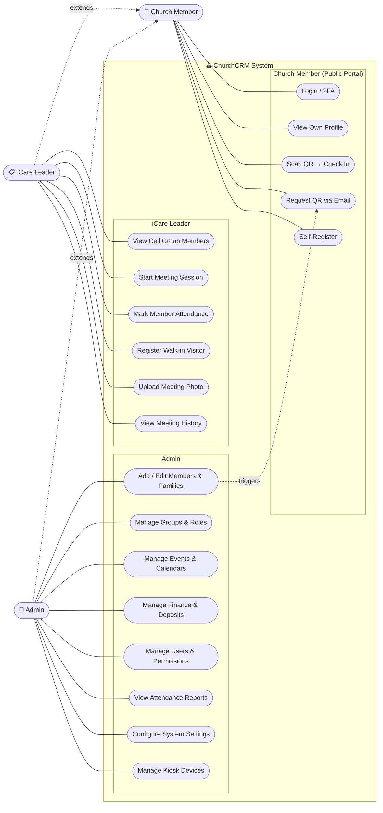
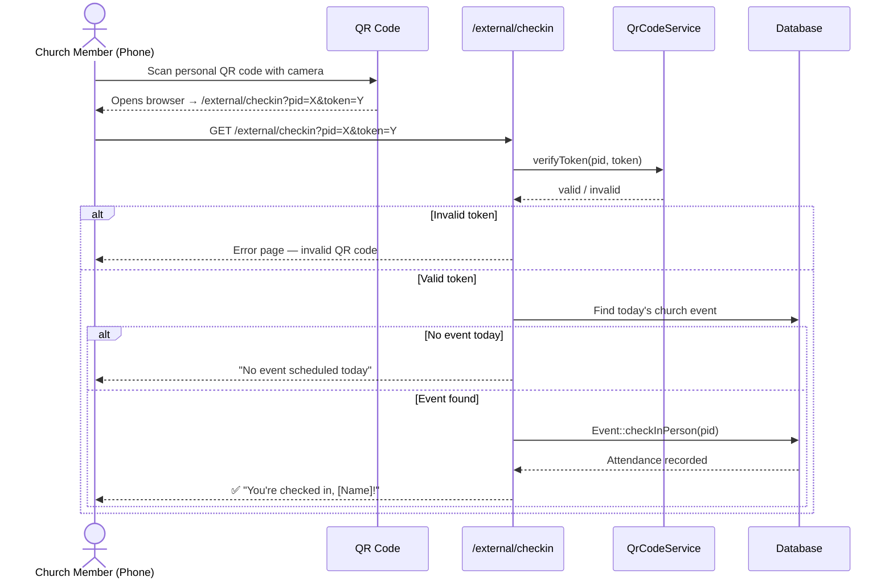
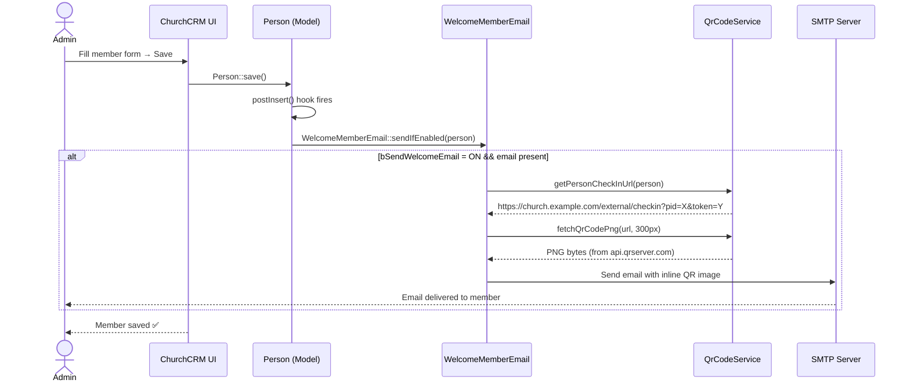
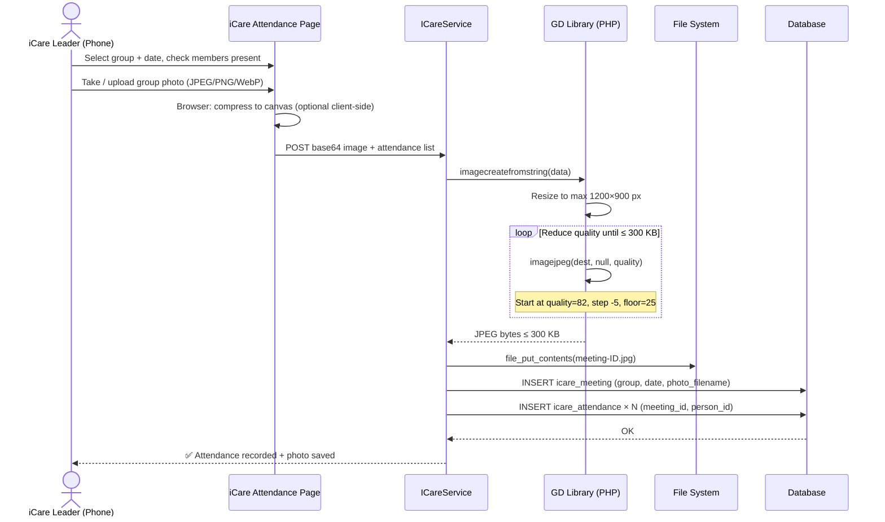
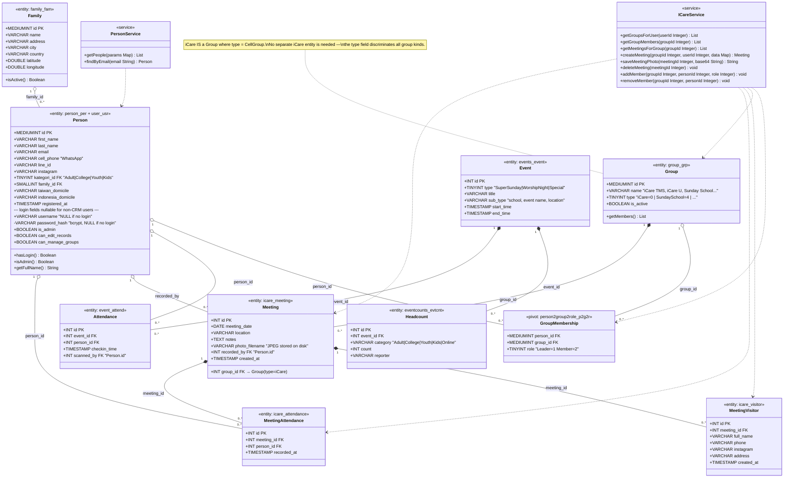

<h1 align="center">IFGF Taiwan — ChurchCRM</h1>

<p align="center">
  Church Management System for <strong>IFGF Taipei & Zhongli</strong><br>
  Member registry · iCare attendance · QR check-in · Birthday calendar · Member portal
</p>

<p align="center">
  <a href="LICENSE"></a>
  <a href="https://github.com/ifgf-tpe/CRM/releases"></a>
  
  
  
</p>

---

## Table of Contents

<!-- toc -->

- [Introduction](#introduction)
- [Execution Status](#execution-status)
- [Minimum Requirements](#minimum-requirements)
- [System Architecture](#system-architecture)
  - [Component Overview](#component-overview)
  - [Software Stack](#software-stack)
- [Use Case Diagram](#use-case-diagram)
- [Workflows (Sequence Diagrams)](#workflows-sequence-diagrams)
  - [UC1: QR Code Attendance Check-In](#uc1-qr-code-attendance-check-in)
  - [UC2: New Member Registration](#uc2-new-member-registration)
  - [UC3: iCare Attendance with Photo](#uc3-icare-attendance-with-photo)
- [Class Diagram](#class-diagram)
  - [Data Dictionary](#data-dictionary)
    - [Person (person\_per, user\_usr combined)](#person-person_per-user_usr-combined)
    - [Family (family\_fam)](#family-family_fam)
    - [Group (group\_grp)](#group-group_grp)
    - [GroupMembership pivot (person2group2role)](#groupmembership-pivot-person2group2role)
    - [Meeting (icare\_meeting)](#meeting-icare_meeting)
    - [MeetingAttendance (icare\_attendance)](#meetingattendance-icare_attendance)
    - [MeetingVisitor (icare\_visitor)](#meetingvisitor-icare_visitor)
    - [Event (events\_event)](#event-events_event)
    - [Attendance (event\_attend)](#attendance-event_attend)
    - [Headcount (eventcounts\_evtcnt)](#headcount-eventcounts_evtcnt)
    - [Business Rules](#business-rules)
- [API Reference](#api-reference)
- [Installation](#installation)
- [Usage Guides](#usage-guides)
- [Contributing](#contributing)
- [References](#references)

<!-- tocstop -->

---

## Introduction

ChurchCRM is an open-source church management platform, adapted here for **IFGF Taipei & Zhongli** — an Indonesian Fellowship of God's Family congregation in Taiwan.

1. **Background**
   - Members are currently tracked across three separate systems: a Google Apps Script spreadsheet project (`church-member-management`), a FastAPI web service (`IFGF-Web-Server`), and a React admin frontend (`IFGF-Web-Admin`).
   - Data is fragmented; birthday reminders, QR attendance, iCare tracking, and member communication each live in different tools.

2. **Importance**
   - Consolidating into ChurchCRM gives the church a single source of truth: full member profiles, weekly Sunday attendance via personal QR codes, iCare cell-group attendance with photo evidence, birthday calendar, and a public member portal — all in one deployed PHP application.

3. **Contribution**
   - IFGF-specific extensions built on top of ChurchCRM 7.x:
     - **Static QR code per member** (HMAC-signed, linked to person ID only) for frictionless Sunday attendance scanning.
     - **iCare attendance module** (`icare_meeting`, `icare_attendance`, `icare_visitor` tables) with compressed photo upload (≤ 300 KB enforced server-side).
     - **Welcome email** with inline QR code sent automatically on member creation.
     - **Public member portal** (`/external/member-portal`) for QR code resend and self-registration.

4. **Challenges**
   - **Schema extension without breaking upstream**: New iCare tables use isolated FK constraints; no upstream ChurchCRM tables were modified.
   - **Mobile photo upload**: Photos from Android/iPhone are compressed server-side (GD library, quality reduction loop) to always produce ≤ 300 KB output regardless of the original camera resolution.
   - **Birthday calendar**: ChurchCRM's built-in `BirthdaysCalendar` surfaces birthdays inside the app; Google Calendar push requires a service-account OAuth integration (planned).

---

## Execution Status

| Feature | Status | Date | Notes |
| --- | --- | --- | --- |
| Base ChurchCRM 7.x install | ✅ | 2026-05-04 | Upstream release `b56406a` |
| Member QR code (static, HMAC-signed) | ✅ | 2026-05-13 | `QrCodeService`, `/external/checkin` |
| Welcome email with inline QR | ✅ | 2026-05-13 | `WelcomeMemberEmail`, `bSendWelcomeEmail` setting |
| Member self-service portal | ✅ | 2026-05-13 | `/external/member-portal`, QR resend by email |
| iCare meeting + attendance tables | ✅ | 2026-05-13 | `7.4.0-icare.sql` migration |
| iCare attendance + photo upload (≤ 300 KB) | ✅ | 2026-05-13 | `ICareService::saveMeetingPhoto()` |
| iCare visitor registration | ✅ | 2026-05-13 | `icare_visitor` table |
| iCare attendance UI (leader view) | ⏳ | — | Routes scaffolded; views in progress |
| Birthday → Google Calendar push | ⏳ | — | Needs Google Calendar API + service account |
| Google OAuth login for members | ⏳ | — | Requires `league/oauth2-google` + `per_google_sub` column |
| Member self-service profile edit | ⏳ | — | Blocked by Google OAuth |
| iCare co-leader role | ⏳ | — | Schema and UI not yet built |
| CGSL group tracking | ⏳ | — | Planned; no timeline |
| Fingerprint device TSV import | ⏳ | — | Planned; no timeline |

---

## Minimum Requirements

| Component | Requirement |
| --- | --- |
| CPU | 2-core 2 GHz (ARM or x86) |
| RAM | 1 GB minimum, 2 GB recommended |
| Storage | 10 GB for application + media |
| PHP | 8.4+ with GD, mbstring, pdo_mysql, json, intl |
| MySQL / MariaDB | MySQL 8.0+ or MariaDB 10.11+ |
| Web server | Apache 2.4+ (mod_rewrite) or nginx 1.24+ |
| Node.js | 24 LTS (build only — not needed at runtime) |
| Composer | 2.x |
| Docker | 24+ (optional — recommended for local dev via DDEV) |

**Recommended local development:** [DDEV](https://ddev.readthedocs.io/) — installs PHP, MariaDB, Apache, and Node automatically via Docker.

---

## System Architecture

### Component Overview

```mermaid
graph TD
    Browser["Admin Browser\n(Tabler / Bootstrap 5 UI)"]
    Phone["Church Member\n(Android / iPhone)"]
    Portal["Public Member Portal\n/external/member-portal"]
    Checkin["QR Check-in\n/external/checkin"]
    CRM["ChurchCRM PHP App\n(Slim 4 MVC)"]
    DB[(MySQL 8\nchurchcrm DB)]
    SMTP["SMTP Server\n(outgoing email)"]
    GCalendar["Google Calendar API\n(planned)"]
    QRApi["api.qrserver.com\n(QR PNG generation)"]

    Browser -->|HTTPS| CRM
    Phone -->|Scan QR → HTTPS| Checkin
    Phone -->|Upload photo| CRM
    Portal -->|email lookup + resend| CRM
    Checkin --> CRM
    CRM --> DB
    CRM -->|Welcome email + QR| SMTP
    CRM -->|Fetch QR PNG| QRApi
    CRM -.->|Birthday events (planned)| GCalendar
```

### Software Stack

| Layer | Technology | Version |
| --- | --- | --- |
| Language | PHP | 8.4 |
| HTTP framework | Slim 4 | 4.x |
| ORM | Propel 2 | 2.x |
| Templating | Twig (email) / PHP views | 3.x |
| Email | PHPMailer | 6.x |
| Frontend CSS | Tabler + Bootstrap 5 | 1.x / 5.x |
| JS bundler | Webpack 5 + TypeScript | 5.x |
| Linter | Biome | 2.x |
| Database | MySQL / MariaDB | 8.0 / 10.11 |
| Dev environment | DDEV | 1.24+ |
| CI testing | Cypress | 15.x |

---

## Use Case Diagram

> **Actor design:** `Admin` and `iCare Leader` are **independent roles** — both extend `Church Member` (they are members first), but share **no hierarchy or permission overlap** between them.



---

## Workflows (Sequence Diagrams)

### UC1: QR Code Attendance Check-In



### UC2: New Member Registration



### UC3: iCare Attendance with Photo



---

## Class Diagram

> **ERD rules applied:**
> - **iCare = Group{type=CellGroup}** — no separate iCare entity; `group_grp` with a type discriminator covers all group kinds (iCare, Sunday School, committees, etc.)
> - **1:1 → merged** into one table (Person absorbs User — same PK, login columns nullable)
> - **1:N → FK** in the child table (no separate join table needed)
> - **M:N → pivot table** (`GroupMembership` links Person ↔ Group with a role)



### Data Dictionary
### Person (person_per, user_usr combined)

Stores every person in the system — church members, family members, CRM staff.
Login credentials (username, password, permissions) are stored as nullable columns on the same table, so no separate User table is needed.

| Column | Type | Notes |
| --- | --- | --- |
| `id` | MEDIUMINT PK | Auto-increment |
| `first_name` | VARCHAR(50) | |
| `last_name` | VARCHAR(50) | |
| `email` | VARCHAR(100) | Primary contact |
| `cell_phone` | VARCHAR(30) | WhatsApp number |
| `line_id` | VARCHAR(50) | LINE messenger ID |
| `instagram` | VARCHAR(100) | Instagram handle |
| `birth_date` | DATE | Date of birth |
| `kategori_id` | TINYINT FK | Adult / College / Teens & Youth / Kids |
| `family_id` | SMALLINT FK → Family | Household grouping |
| `taiwan_domicile` | VARCHAR(100) | Area in Taiwan |
| `indonesia_domicile` | VARCHAR(100) | Indonesian home city |
| `registered_at` | TIMESTAMP | Registration timestamp |
| `username` | VARCHAR(32) UNIQUE NULL | `NULL` = no CRM login |
| `password_hash` | VARCHAR(500) NULL | bcrypt; `NULL` if no login |
| `is_admin` | BOOLEAN | CRM admin flag |
| `can_edit_records` | BOOLEAN | Edit permission |
| `can_manage_groups` | BOOLEAN | Group management permission |

**Kategori (computed from profession × education):**

| Kategori | Condition |
| --- | --- |
| Kids | SD (elementary) |
| Teens and Youth | SMP / SMA |
| College | Mahasiswa (S1 / Diploma) |
| Adult | Pekerja (working professional) |

> **DB note:** In the current ChurchCRM codebase, login data lives in `user_usr` (sharing `per_ID` as PK).
> The merged-table design above reflects the simplified conceptual model; a future migration will collapse both tables into `person_per`.

---

### Family (family_fam)

Groups persons who share a household. Optional — a person may have no family record.

| Column | Type | Notes |
| --- | --- | --- |
| `id` | MEDIUMINT PK | Auto-increment |
| `name` | VARCHAR(100) | Household/family name |
| `address` | VARCHAR(100) | Street address |
| `city` | VARCHAR(50) | City in Taiwan |
| `country` | VARCHAR(50) | |
| `latitude` | DOUBLE | For map view |
| `longitude` | DOUBLE | |

---

### Group (group\_grp)

A group that meets regularly. The `type` field discriminates all group kinds — iCare cell groups, Sunday School, and committees all share this one entity.

| Column | Type | Notes |
| --- | --- | --- |
| `id` | MEDIUMINT PK | Auto-increment |
| `name` | VARCHAR(50) | e.g., "iCare TMS", "iCare U" |
| `type` | TINYINT | 0 = iCare, 4 = Sunday School |
| `is_active` | BOOLEAN | Active / disbanded |

**Known iCare groups:** `iCare TMS` · `iCare U` · `iCare Keelung` · `iCare Linkou` · `iCare Immanuel` · `iCare Freshcare` · `iCare Tamkang` · `iCare Hsinchu` · `iCare Liming` · `iCare Home`

---

### GroupMembership pivot (person2group2role)

M:N pivot connecting persons to groups with a role.

| Column | Type | Notes |
| --- | --- | --- |
| `person_id` | MEDIUMINT FK → Person | (composite PK) |
| `group_id` | MEDIUMINT FK → Group | (composite PK) |
| `role` | TINYINT | 1 = Leader, 2 = Member |

---

### Meeting (icare_meeting)

One row per weekly iCare session.

| Column | Type | Notes |
| --- | --- | --- |
| `id` | INT PK | Auto-increment |
| `group_id` | MEDIUMINT FK → Group | Which cell group |
| `meeting_date` | DATE | Date of the session |
| `location` | VARCHAR(255) | Physical venue (optional) |
| `notes` | TEXT | Leader notes |
| `photo_filename` | VARCHAR(255) | JPEG file on disk, ≤ 300 KB |
| `recorded_by` | MEDIUMINT FK → Person | Who recorded attendance |
| `created_at` | TIMESTAMP | |

---

### MeetingAttendance (icare_attendance)

Tracks existing members who attended a meeting session.

| Column | Type | Notes |
| --- | --- | --- |
| `id` | INT PK | Auto-increment |
| `meeting_id` | INT FK → Meeting | Which session |
| `person_id` | MEDIUMINT FK → Person | Attending member |
| `recorded_at` | TIMESTAMP | |
| **UNIQUE** | (`meeting_id`, `person_id`) | No duplicate check-ins |

---

### MeetingVisitor (icare_visitor)

New walk-in visitors (not yet in the system) who attended a session.

| Column | Type | Notes |
| --- | --- | --- |
| `id` | INT PK | Auto-increment |
| `meeting_id` | INT FK → Meeting | Session visited |
| `full_name` | VARCHAR(100) | |
| `phone` | VARCHAR(30) | WhatsApp |
| `instagram` | VARCHAR(100) | Social media handle |
| `address` | VARCHAR(255) | Residential area (Taiwan) |
| `created_at` | TIMESTAMP | |

---

### Event (events_event)

Church-wide event. Covers four types:

| Type | Examples | Location |
| --- | --- | --- |
| **Super Sunday** | Weekly Sunday Gathering | Taipei / Zhongli / Both |
| **iCare** | (tracked via Meeting table instead) | Per-group venue |
| **Worship Night** | School-based, volunteer, open | Taipei / Zhongli |
| **Special Event** | Passover, Christmas, Retreat | Taipei / Zhongli / Offsite |

| Column | Type | Notes |
| --- | --- | --- |
| `id` | INT PK | Auto-increment |
| `type` | TINYINT | Event category |
| `title` | VARCHAR(255) | e.g., "Super Sunday — Taipei" |
| `sub_type` | VARCHAR(255) | School name, event name |
| `start_time` | TIMESTAMP | |
| `end_time` | TIMESTAMP | |

---

### Attendance (event_attend)

Individual QR-code check-in at a church-wide event.

| Column | Type | Notes |
| --- | --- | --- |
| `id` | INT PK | Auto-increment |
| `event_id` | INT FK → Event | Which event |
| `person_id` | MEDIUMINT FK → Person | Who checked in |
| `checkin_time` | TIMESTAMP | Scan time |
| `scanned_by` | MEDIUMINT FK → Person | Staff who processed |
| **UNIQUE** | (`event_id`, `person_id`) | One check-in per person |

---

### Headcount (eventcounts_evtcnt)

Aggregate per-category headcount for a Sunday or Worship Night session.

| Column | Type | Notes |
| --- | --- | --- |
| `event_id` | INT FK → Event | Which session |
| `category` | VARCHAR(20) | Adult / College / Youth / Kids / Online |
| `count` | INT | Number of attendees |
| `reporter` | VARCHAR(20) | Name of reporter |

---

### Business Rules

1. **Primary cell group**: Every member is assigned to one primary iCare group via `GroupMembership`. `"Belum mengikuti"` (not yet assigned) is the default.
2. **Cross-group visits**: A member may attend any Meeting — `MeetingAttendance` is not restricted to their primary group.
3. **New visitor flow**: Walk-in visitors at iCare go into `MeetingVisitor`. After follow-up, a full `Person` record is created and they are assigned to a iCare.
4. **Sunday headcounts**: Aggregate totals (Adult/College/Youth/Kids/Online) go into `Headcount`. Individual QR scans also create `Attendance` rows for members who scan.
5. **Location split**: Super Sunday runs in Taipei (TPE) and Zhongli (ZL) as separate `Event` rows; each row covers one physical location.
6. **Login access**: A `Person` becomes a CRM user by setting `username` and `password_hash`. All other persons have those fields as `NULL`.


## API Reference

### Public Endpoints (no login required)

| Method | Path | Description |
| --- | --- | --- |
| GET | `/external/member-portal` | Member self-service portal page |
| POST | `/external/member-portal/resend-qr` | Email QR code to member by address |
| GET | `/external/checkin?pid=X&token=Y` | QR scan → record attendance + confirmation |

### Admin Endpoints (login required)

| Method | Path | Description |
| --- | --- | --- |
| GET | `/people/view/{id}` | Member profile (includes QR code card) |
| GET/POST | `/v2/icare/{groupId}/attendance` | Record iCare attendance + photo |
| GET | `/api/people` | Member list (JSON) |
| POST | `/api/public/register/family` | Public family registration (if enabled) |

### iCare API (JSON, login required)

| Method | Path | Description |
| --- | --- | --- |
| GET | `/api/icare/groups` | Groups the current user leads |
| GET | `/api/icare/groups/{id}/members` | Members of a group |
| GET | `/api/icare/groups/{id}/meetings` | Meeting history for a group |
| POST | `/api/icare/groups/{id}/meetings` | Create meeting + record attendance |
| POST | `/api/icare/meetings/{id}/photo` | Upload/replace meeting photo |
| GET | `/api/icare/meetings/{id}` | Meeting detail + attendance list |
| DELETE | `/api/icare/meetings/{id}` | Delete meeting and photo |

---

## Installation

### Recommended: DDEV (local development)

```bash
# 1. Clone the repo
git clone https://github.com/ifgf-tpe/CRM.git churchcrm
cd churchcrm

# 2. Install dependencies
npm install        # Node packages + locale files
cd src && composer install && cd ..

# 3. Build frontend assets
npm run build

# 4. Start DDEV (handles MariaDB + Apache + PHP automatically)
ddev start

# 5. Apply iCare schema (one-time)
ddev exec mysql churchcrm < src/mysql/upgrade/7.4.0-icare.sql

# 6. Open in browser
ddev launch
# Default credentials: admin / changeme
```

### Docker Compose (production-like)

```bash
cd docker
cp .env.example .env   # edit passwords
docker compose -f docker-compose.nginx.yaml up -d
```

### Configuration

After first login: **Admin → System Settings → New Members & Greeting**

| Setting | Purpose |
| --- | --- |
| `bSendWelcomeEmail` | Send welcome email + QR code on new member creation |
| `sWelcomeEmailSubject` | Email subject line (leave blank for default) |
| `sQrCodeSecret` | HMAC signing secret for QR tokens — set to a long random string |

---

## Usage Guides

Step-by-step usage guides are in [`future-work.md`](future-work.md) → **Feature Usage Guides**:

- **Guide 1**: [Weekly Attendance via QR Code](future-work.md#guide-1-weekly-attendance-via-qr-code)
- **Guide 2**: [Member Registration Flow](future-work.md#guide-2-member-registration-flow) (birthday, QR code, welcome email)
- **Guide 3**: [Member Self-Service Portal](future-work.md#guide-3-member-self-service-portal)
- **Guide 4**: [iCare Attendance with Photo Upload](future-work.md#guide-4-icare-attendance-with-photo-upload-planned) *(planned)*
- **Guide 5**: [Google Account Login / OAuth](future-work.md#guide-5-google-account-login--oauth-planned) *(planned)*

---

## Contributing

We welcome contributions! See [CONTRIBUTING.md](CONTRIBUTING.md) for how to file issues and submit pull requests.

For IFGF Taiwan-specific features (iCare, QR attendance, member portal), open an issue describing the use case and tag it `ifgf-taiwan`.

[](https://github.com/ChurchCRM/CRM/graphs/contributors)
[](https://discord.gg/tuWyFzj3Nj)

---

## References

1. ChurchCRM upstream project — [churchcrm.io](https://churchcrm.io) / [github.com/ChurchCRM/CRM](https://github.com/ChurchCRM/CRM)
2. IFGF-Web-Server (FastAPI backend) — `D:/Users/Ian Joseph/Documents/GitHub/IFGF-Web-Server`
3. IFGF-Web-Admin (React frontend) — `D:/Users/Ian Joseph/Documents/GitHub/IFGF-Web-Admin`
4. church-member-management (GAS origin) — `D:/Users/Ian Joseph/Documents/GitHub/church-member-management`
5. Slim 4 Framework — [slimframework.com](https://www.slimframework.com/)
6. Propel ORM — [propelorm.org](http://propelorm.org/)
7. Tabler UI Kit — [tabler.io](https://tabler.io/)
8. api.qrserver.com — QR code generation API used for member attendance codes
9. Project Documentation SOP Template — [bmw-ece-ntust/SOP](https://github.com/bmw-ece-ntust/SOP/blob/master/project-documentation.md)
